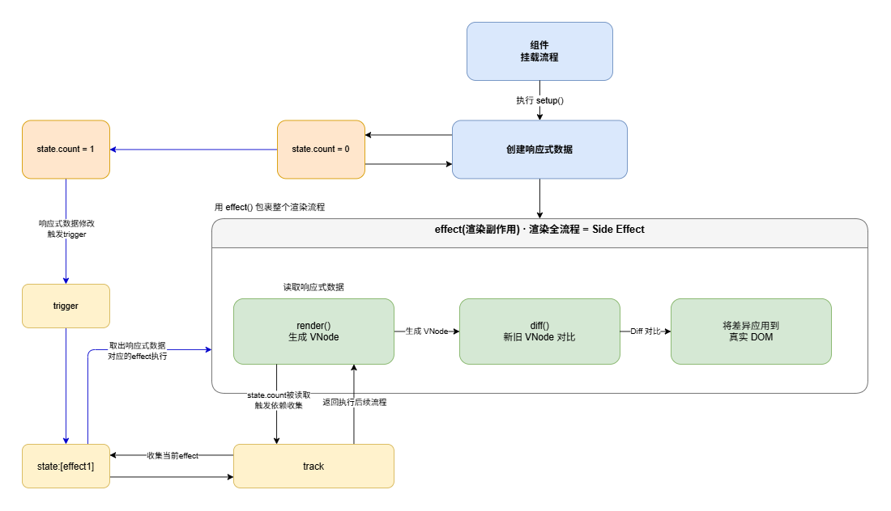
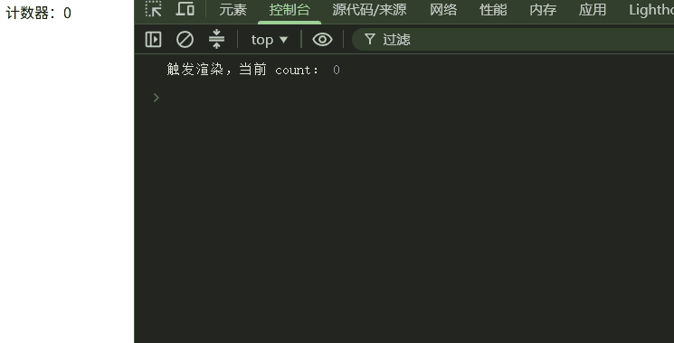

# 响应式前端框架——响应式系统

> 本文仅代表作者个人观点，如果内容有错误或和你理解上有所出入，欢迎交流与指正。

很多人觉得，一个响应式前端框架是一个非常复杂的系统。

比如 React、Vue，源码动辄几十万行。第一次打开源码，可能会看到各种 Scheduler、Fiber、Effect、Render、Diff、Hook……很容易产生一种感觉：

> “这东西太复杂了，我根本不知道从哪里开始看。”

但实际上，React 和 Vue 今天的复杂，并不代表它们最初就是这么复杂的。

这些框架经过了多年的发展，逐渐加入了性能优化、边界处理、兼容性、调度系统、生态适配等大量能力。同时，为了保证版本升级过程中的兼容性，也积累了大量历史代码。

所以，当我们直接阅读一个成熟框架的源码时，看到的往往已经是一个经过多年演化后的最终形态。

但如果我们反过来思考：

**一个响应式前端框架最开始是怎么诞生的？**

答案其实非常简单。它可以从一个非常基础的功能开始：

> 当数据发生变化时，让依赖这些数据的代码重新执行。

这也是这个系列想做的事情。

**从拙劣到精密**：这个系列不会一开始就实现一个"完整的 响应式前端开发框架"，而是会从笨拙地实现一个最简单的响应式系统开始，一步一步地构建出一个完整且精密的响应式前端开发框架。

---

## 一、组件渲染的最短链路

要理解响应式框架如何将组件渲染到页面上，可以先看看这套组件渲染到页面的最短链路：

```
组件挂载
  ↓
setup：创建响应式数据
  ↓
render：根据数据生成 VNode
  ↓
Diff：对比新旧VNode
  ↓
真实 DOM：将差异应用到真实DOM上
```

整套流程可以抽象为：

```
组件 → setup（创建响应式数据）→ [render生成VNode → Diff → 更新真实DOM]（effect包裹）
```



## 二、为什么渲染流程要封装成 effect？

这是整个响应式模型最关键的设计决策，本质是为了建立 `[数据 → 视图]` 的自动关联。

组件的渲染全流程（生成 VNode → Diff 对比 → 更新真实 DOM）本身就是一个副作用（Side Effect）：它依赖响应式数据作为输入，最终修改页面 DOM 产生外部影响。把这一整套流程包裹进 effect 函数，核心目的是让渲染成为响应式系统可以感知、可以调度的依赖任务：

- **首次挂载执行**：effect 内部运行渲染逻辑，渲染过程中读取响应式数据 → 触发数据的读取拦截 → 将当前 effect 收集为该数据的依赖。
- **数据变更时**：触发数据的写入拦截 → 取出该数据关联的所有 effect → 重新执行 effect → 自动走完 `[重渲染 → Diff → 更新DOM]` 的完整流程。

## 三、最简响应式系统完整实现

基于上述推论，我们可以得出一个最简单的响应式系统需要包含如下部分：

- 存储响应式对象、属性与 effect 映射关系的依赖容器
- 依赖收集函数 `track`
- 触发更新函数 `trigger`
- 生成响应式数据的 `reactive` API
- 包裹副作用流程的 `runEffect` 函数

接下来我们就来实现这个最简单的响应式系统。

> 注：以下实现为原理演示的最简版本，仅保留核心逻辑以降低理解成本；后续可根据实际应用场景逐步迭代优化与功能扩展。

### 1. 全局依赖容器

采用三层结构存储依赖关系：

- 第一层 Map：键为响应式对象，值为该对象对应的属性依赖映射表
- 第二层 Map：键为对象的属性名，值为该属性对应的副作用集合
- 第三层 Set：存储所有依赖该属性的 effect 函数，天然去重

```js
// 全局依赖容器：Map<响应式对象, Map<属性名, Set<effect函数>>>
const targetMap = new Map();
// 当前正在执行的活跃 effect，用于依赖收集时建立关联
let activeEffect = null;
```

### 2. track：依赖收集函数

在响应式数据被读取时调用，将当前正在执行过程中的 effect 存入该属性对应的依赖集合：

```js
function track(target, key) {
  // 无活跃 effect 时无需收集（比如手动读取数据的场景）
  if (!activeEffect) return;

  // 取出该对象对应的属性依赖映射表
  let depsMap = targetMap.get(target);
  if (!depsMap) {
    depsMap = new Map();
    targetMap.set(target, depsMap);
  }
  // 取出该属性对应的副作用集合
  let effects = depsMap.get(key);
  if (!effects) {
    effects = new Set();
    depsMap.set(key, effects);
  }
  effects.add(activeEffect);
}
```

### 3. trigger：触发更新函数

在响应式数据被修改时调用，取出该属性对应的所有 effect 并执行：

```js
function trigger(target, key) {
  // 取出该对象对应的属性依赖映射表
  const depsMap = targetMap.get(target);
  if (!depsMap) return;

  // 只取出该属性对应的副作用集合
  const effects = depsMap.get(key) || new Set();
  // 执行effect 相当于重走组件渲染整套流程
  effects.forEach(effect => effect());
}
```

### 4. reactive：创建响应式对象

通过 Proxy 劫持对象的读写操作，在读取时收集依赖、写入时触发更新：

```js
function reactive(target) {
  return new Proxy(target, {
    get(target, key, receiver) {
      // 读取属性：收集该属性的依赖
      track(target, key);
      // 用 Reflect 保证 this 指向正确的代理对象
      return Reflect.get(target, key, receiver);
    },
    set(target, key, value, receiver) {
      // 先更新属性值
      const result = Reflect.set(target, key, value, receiver);
      // 更新成功后触发该属性的依赖
      trigger(target, key);
      return result;
    }
  });
}
```

### 5. runEffect：副作用包裹函数

负责注册副作用函数，并通过首次执行触发初始依赖收集：

```js
function runEffect(fn) {
  activeEffect = fn;  // 标记当前活跃 effect
  fn();               // 执行副作用，内部读数据时会触发收集
  activeEffect = null; // 执行完毕清空标记
}
```

## 四、对应组件渲染流程的验证示例

```js
// 1. 组件 setup 阶段：创建响应式数据
const state = reactive({ count: 0 });

// 2. 渲染逻辑：对应 render → Diff → 更新真实 DOM 的完整过程
function componentRender() {
  // 模拟读取数据、生成 VNode、更新页面
  console.log('触发渲染，当前 count：', state.count);
  document.body.innerText = `计数器：${state.count}`;
}

// 3. 组件挂载：将渲染流程作为副作用注册
runEffect(componentRender);

// 4. 数据变更：自动触发重新渲染
setTimeout(() => {
  state.count++; 
  // 控制台会再次打印渲染日志，页面内容自动更新
}, 1000);
```

实现效果：



## 五、结语

到这里，一个最简响应式系统就全部实现了。下一章我们会逐一拆解：React 是如何通过 JSX 生成虚拟 DOM，Vue SFC 又是如何完成这一过程的，最终我们会亲手实现一个基于 JSX 的简易虚拟 DOM 生成函数。

---

本系列源码与配套示例见：[actview · principle/reactivity](https://github.com/ALiuYiLin/actview/tree/principle/reactivity)
